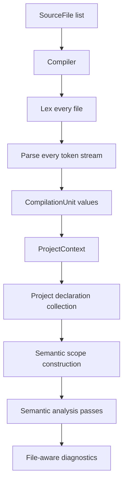
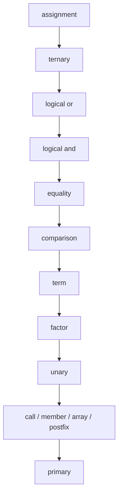
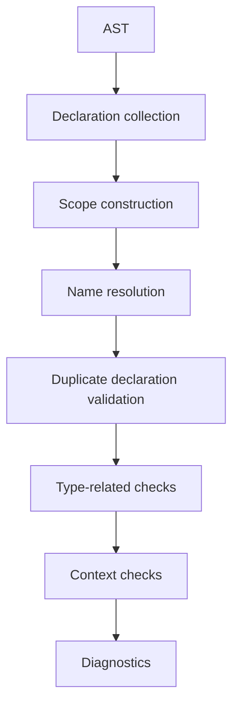
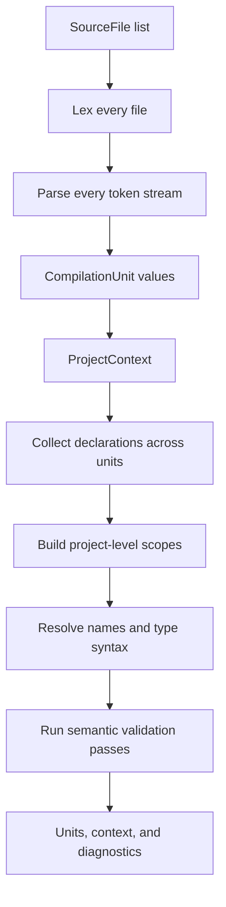
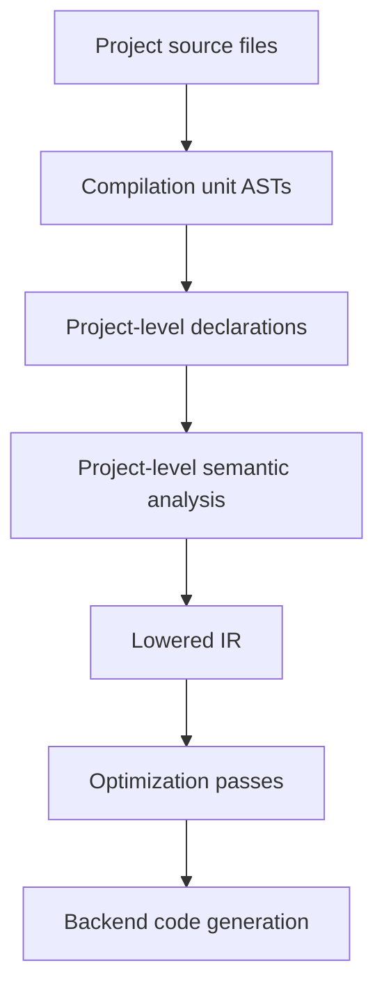

# Compiler architecture

This is the consolidated guide for the Nova compiler front end. It covers the
current layer boundaries, parser rules, semantic-analysis responsibilities, type
model boundary, and the planned multi-file project pipeline.

For the authoritative implementation checklist, see [`../PLAN.md`](../PLAN.md).
For long-term language goals, see [`language-design.md`](language-design.md).

## Current pipeline

The repository implements single-file lexer/parser APIs and a project-level
compiler front-end entry point:



There is no backend-neutral IR, optimizer, or native code generator yet. The next
major architecture step is Phase 7 standard-library source loading.

## Layer ownership

### Lexer

The lexer turns source text into tokens and reports lexical diagnostics. It
should not know about AST nodes, scopes, semantic declarations, or type checking.

Responsibilities:

- recognize keywords, identifiers, literals, operators, delimiters, and special
  tokens;
- preserve source-position information for later diagnostics;
- recover from invalid characters or malformed literals where possible;
- produce a token stream for the parser.

### Parser and AST

The parser is a recursive-descent parser. It consumes lexer tokens, recognizes
source syntax, and builds source-level AST nodes. The AST should represent what
the user wrote, not a lowered or optimized form.

The parser answers:

> Is this valid Nova syntax?

Semantic analysis answers:

> Does this syntactically valid Nova program make sense?

That boundary is intentional. Syntactically valid programs should produce AST
nodes even when later semantic passes reject them:

```nova
unknownVariable + 1;
1 = 2;
public class A {}
public class A {}
```

The examples above should parse, then fail in semantic name resolution,
l-value analysis, or duplicate declaration validation.

### Semantic declarations and scopes

After parsing, semantic passes collect declarations and construct lexical scopes
from the AST. Parser-owned `SymbolTable` scope construction has been removed.

Semantic declarations represent named program entities independently from parser
helper state:

- classes;
- fields;
- methods and constructors;
- functions;
- parameters;
- local variables;
- for-each variables.

Semantic scopes represent lexical visibility. Current scope categories include
global, class, function, constructor, block, loop, switch, and branch scopes.
The semantic scope tree is the source of truth for name visibility.

### Semantic analysis

Semantic analysis validates meaning after syntax has been parsed.

Current semantic responsibilities include:

- name resolution;
- unknown type and unknown name diagnostics;
- duplicate declaration validation;
- initializer and assignment type checking;
- function and method call checks;
- class subtype assignment and argument compatibility;
- basic overload selection for functions, methods, and constructors;
- direct and inherited class member lookup;
- l-value validation;
- return checking;
- `break` and `continue` context checking.

Future semantic responsibilities include access-control checks, inheritance
conflict and override validation, generic constraints, generic-aware overload
specificity, source-loaded standard-library declarations, and user-defined Nova
value/math types.

## Parser rules

### Parser structure

Parser implementation is split into focused grammar helpers:

- top-level orchestration;
- declaration parsing;
- class parsing;
- expression parsing;
- shared cursor and recovery support;
- parser diagnostics.

This keeps individual grammar methods smaller and makes token consumption easier
to audit.

### Cursor contract

The parser cursor follows three core operations:

- `check(...)` inspects without consuming;
- `match(...)` consumes only if the current token matches;
- `consume(...)` requires a token and reports a parser diagnostic when it is
  missing.

Cursor movement should be obvious from the local method body. Unexpected token
advancement is one of the easiest ways to introduce parser bugs.

### Expression parsing

Expression parsing follows precedence levels:



Preserve this structure unless there is a strong reason to replace the
expression parser.

### Declarations and classes

Declaration parsing recognizes source-level declarations such as classes,
constructors, methods, functions, variables, fields, and parameters. It preserves
declaration names, type syntax, parameters, bodies, and member lists in the AST;
semantic declaration collection and semantic scopes decide visibility and
validity later.

Class parsing currently supports fields, methods, constructors, inheritance
syntax, generic syntax, and nested class structure where supported by the AST.
Every class member must declare `public`, `private`, or `protected`.

The parser may recognize superclass syntax and class generic parameter names,
but semantic analysis decides whether a superclass exists, whether generic names
are visible or duplicated, and how constraints or specialization rules behave.

### Error recovery

The parser should report errors and continue when possible. Recovery is
especially important at top-level declaration, statement, block, and class-body
member boundaries.

The current recovery model uses `ParseException` plus explicit recovery
boundaries. It does not create AST error nodes yet. Successfully recovered AST
nodes are retained, and collected parser diagnostics are reported at the end of
the parse run.

Recovery loop guards should inspect raw token kinds instead of using
`check(...)`, because `check(...)` intentionally reports parser diagnostics for
unknown tokens. Parser recovery changes should usually include regression tests
that prove valid code after the error is still parsed.

### Parser semantic boundary tests

Parser tests should protect the rule that syntactically valid but semantically
invalid programs still produce AST nodes. Representative cases include
unresolved identifiers, object creation for undeclared classes, assignments to
non-l-values, duplicate declarations, unknown declared types, and unknown
superclass names.

These cases belong in parser tests when the assertion is about AST shape or
absence of parser diagnostics. The matching meaning diagnostics belong in
semantic tests.

Do not add parser checks for undefined names, duplicate declarations, invalid
assignment targets, invalid return placement, invalid `break` or `continue`
placement, type mismatches, overload resolution, access control, or inheritance
validity.

## Semantic rules

The current semantic side is split into explicit passes and supporting models:



The exact pass structure may evolve as the compiler front end stabilizes, but
the ownership boundary should stay stable: meaning belongs here, not in parsing.

### Name resolution

Name resolution checks whether identifiers and referenced classes or types can
be found from the current semantic scope. For example, `x + 1;` should produce an
undefined-name diagnostic when `x` has no visible declaration. `new Missing();`
should produce an undefined-class diagnostic when no visible class declaration
defines `Missing`.

### Duplicate validation

Duplicate validation reports repeated declarations in the same semantic scope.
Functions, methods, and constructors are overloadable by parameter signature.
Declarations with the same name but different parameter type lists are allowed;
declarations with the same name and same parameter type list are duplicates.
Return type alone does not create a distinct overload.

### Type checking

Type checking is partial and should expand carefully. Current checks include:

- initializer compatibility;
- assignment compatibility;
- function-call argument count and argument type checks;
- array access checks;
- direct and inherited class field access;
- direct and inherited class method calls;
- class subtype assignment and argument compatibility through superclass chains;
- basic overload selection with no-match and ambiguity diagnostics;
- return value checks.

Future checks include inheritance conflict checks, override compatibility, access
modifiers, generic constraints, generic-aware overload specificity, user-defined
Nova value types, and operator overload resolution.

### L-value, return, and loop-control checks

Assignment target validity belongs in semantic analysis. `1 = 2;` is
syntactically recognizable as an assignment expression, but it is semantically
invalid because a literal is not assignable.

Return checking validates whether `return` statements appear in valid function,
method, or constructor contexts and whether their value matches the declared
return type. More control-flow-sensitive return analysis can be added later.

`break` and `continue` are syntactically valid statements, but semantic analysis
reports invalid placement outside the loop or switch contexts where the language
allows them.

## Type model boundary

Nova separates type spelling from resolved type meaning. In shorthand:

$$
\text{TypeSyntax} \rightarrow \text{TypeSymbol}
$$

Parser-owned code preserves type syntax. Semantic-owned code resolves type
meaning.

### `TypeSyntax`

`TypeSyntax` nodes live under `parser.ast.nodes.type`. They preserve source-level
type shape before semantic resolution:

- `NamedTypeSyntax` stores a written type name such as `int`, `Box`, `Missing`,
  or `T`;
- `ArrayTypeSyntax` stores the element type syntax plus parsed dimension
  expressions;
- `GenericTypeSyntax` stores a class generic-parameter name such as `T` from
  `class Box[T]`.

The parser records `Box value;` as named type syntax. It does not decide whether
`Box` exists.

### `TypeSymbol`

`TypeSymbol` implementations live under `semantic.type.symbol`. They represent
resolved semantic categories:

- `ValueTypeSymbol` for Nova value/math types, including built-in primitive-like
  types;
- `ClassTypeSymbol` for object/class types backed by semantic class
  declarations;
- `ArrayTypeSymbol` for arrays with a resolved element type;
- `GenericParameterSymbol` for visible generic parameter names;
- `UnknownTypeSymbol` for unresolved names that should still allow later
  diagnostics to continue.

Semantic passes use resolved type symbols for declared type validation,
initializer and assignment compatibility, array access, function and method
argument checks, member lookup, class subtype assignment, and overload selection.

### `ReturnType` during migration

`ReturnType` is a temporary compatibility adapter. It may support older manual
AST construction in tests and printer paths that still expect a `ReturnType`,
but it should not be used as the semantic type model.

New parser-created declarations should carry `TypeSyntax` directly. Semantic
passes should prefer parsed syntax before consulting syntaxless compatibility
fallbacks through `semantic.type.ReturnTypeSyntaxBridge`.

## Project pipeline

Phase 6 moved Nova from a single-file front end toward a project-level compiler
pipeline. The implementation lexes and parses every source file before
declaration collection or semantic analysis begins.



Goals:

- preserve the parser/semantic boundary;
- collect declarations across all parsed units before resolving names or types;
- keep diagnostics tied to the source file that produced them;
- reserve package and import placeholders without implementing full package
  semantics yet.

Non-goals:

- do not implement Orbit, Quark dependency resolution, or package-manager
  behavior in the compiler pipeline;
- do not load the standard library as source yet;
- do not introduce IR or backend behavior.

### `SourceFile`

`SourceFile` is the immutable input identity and source text. `compiler.SourceFile`
and `compiler.SourceOrigin` are available.

It owns a stable file identity, complete source text, and optional origin
metadata. It does not own tokens, AST nodes, semantic declarations, semantic
scopes, or phase diagnostics.

### `CompilationUnit`

`CompilationUnit` is the syntax result for one `SourceFile`.
`compiler.CompilationUnit` is available.

It owns the source file, token stream, lexer diagnostics, parser diagnostics,
top-level AST statements, and future package/import placeholder data. It should
not decide whether a referenced class exists, whether an imported symbol is
visible, or whether a declaration is duplicated.

### `ProjectContext`

`ProjectContext` is the project-level semantic workspace.
`compiler.ProjectContext` is available.

It owns the ordered list of compilation units, aggregated file-aware diagnostics,
project declaration collection, root project/global semantic scope, future
package/import placeholder state, and future standard-library or native
declaration inputs.

The initial package model should be simple: all files belong to one default
project namespace unless a later package/import design says otherwise. Duplicate
top-level declarations from different files are therefore duplicates in the
shared namespace.

### `Compiler`

`Compiler` is the orchestrator. `compiler.Compiler` is available.

It coordinates phases without becoming a semantic pass or parser helper.

Implemented phase order:

1. Validate source-file identities, reporting duplicate input identities as
   project diagnostics.
2. Lex every source file.
3. Parse every token stream.
4. Stop before semantic analysis if lexer or parser errors should block semantic
   checks in the first implementation.
5. Create the `ProjectContext`.
6. Collect declarations from all units.
7. Build project-level scopes.
8. Resolve names and type syntax across the whole project.
9. Run duplicate, type, l-value, return, and loop-control checks.

Diagnostics should be file-aware at the project boundary through
`compiler.SourceDiagnostic`. Do not encode file paths into diagnostic messages;
formatting belongs at the reporting boundary where file identity, line, and
column can be combined for CLI output or tests. Semantic diagnostics are wrapped
with a source file when their line and column uniquely identify one compilation
unit; ambiguous semantic locations remain project-level diagnostics until AST
nodes carry explicit source ownership.

The first acceptance target is covered by the project-pipeline tests:

```nova
// a.nv
public class A {
  public B peer;
}
```

```nova
// b.nv
public class B {}
```

The project-level entry point compiles both files without depending on one file
being parsed before the other for semantic visibility.

## Future architecture

The planned long-term compiler pipeline is:



The next major architecture milestones are multi-file compilation, standard
library loading as Nova source, lowered IR, optimization, and backend code
generation.
