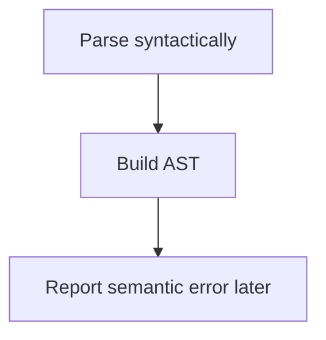
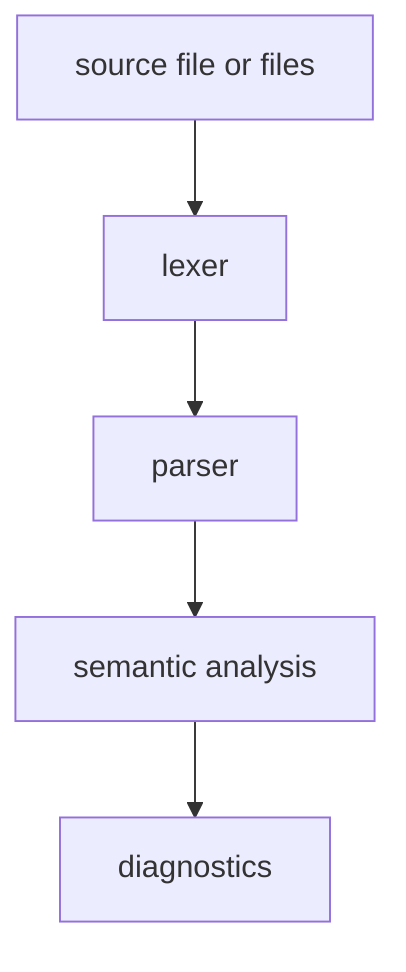

# Contributing notes

This project is still evolving quickly. These notes describe the development
style, testing expectations, and documentation rules that keep compiler changes
reviewable.

For the implementation plan, see [`../PLAN.md`](../PLAN.md). For compiler-layer
details, see [`architecture.md`](architecture.md).

## Core rule

Keep changes small, testable, and tied to one compiler layer whenever possible.

A good commit usually does one thing:

- fixes one parser rule;
- adds one diagnostic;
- moves one semantic check out of the parser;
- adds one semantic validation;
- adds one regression test;
- updates one documentation page.

Do not start advanced Nova features too early. Features such as generics,
lambdas, variadic generics, monomorphization, operator-overloadable Nova types,
and backend code generation depend on a stable semantic model. Follow the phase
ordering in [`../PLAN.md`](../PLAN.md) unless there is a strong reason to change
it.

## Build and test

Run the Java test suite from the repository root:

```bash
./mvnw test
```

On Windows:

```powershell
.\mvnw.cmd test
```

The Maven Wrapper is included in the repository, so contributors should prefer it
over a globally installed Maven version.

The project is configured for Java 24 or newer. GitHub Actions currently tests
with Temurin JDK 24 and 26.

## Parser changes

Parser changes should stay syntactic. The parser should not reject code only
because a name is undefined, a type does not exist, a declaration is duplicated,
or an assignment target is semantically invalid.

Prefer this flow:



Parser tests should usually assert one of these things:

- AST shape;
- diagnostic shape;
- successful recovery after invalid input;
- correct precedence and associativity;
- correct token consumption behavior.

## Semantic changes

Semantic changes should usually include tests.

When adding a new semantic rule:

1. Add or identify the smallest source snippet that should fail.
2. Assert the diagnostic.
3. Implement the rule.
4. Keep parser behavior unchanged unless syntax truly changed.

Semantic tests should cover meaning, not syntax. Useful cases include undefined
identifiers, undefined types/classes, duplicate declarations, invalid assignment
targets, type mismatches, invalid function-call arguments, overload selection,
subtype assignment, inherited member access, invalid array access, invalid return
statements, and invalid `break` or `continue` placement.

## Diagnostics

Diagnostics should be structured and deterministic.

Prefer diagnostics that include:

- phase;
- severity;
- message;
- source line and column where available;
- expected token/type information where useful;
- actual token/type information where useful.

Avoid reintroducing global error state.

## Test organization

Tests are grouped by compiler layer. Current or intended groups include:

- lexer tests;
- parser tests;
- semantic analysis tests;
- diagnostic tests;
- integration tests.

Lexer tests should cover tokenization and lexical diagnostics: identifiers,
keywords, literals, comments, whitespace handling, unknown tokens, malformed
escapes, unterminated strings or characters, and source-position reporting.

Parser tests should cover AST shape, syntax diagnostics, expression precedence,
assignment associativity, invalid syntax recovery, unknown token recovery,
block-level recovery, parser cursor movement regressions, and semantic-boundary
AST preservation.

Semantic tests should cover language meaning. Integration tests should cover
complete front-end flows:



Multi-file integration tests should use the project-level compiler entry point.
The baseline target is a two-file cross-reference test where one source file
refers to a class declared in another file, proving that declaration collection
happens across all parsed units before name/type resolution.

## Testing rule of thumb

When fixing a compiler bug, add the smallest source snippet that reproduces it.

Good tests usually answer one question:

- Did this source produce the expected AST?
- Did this source produce the expected diagnostic?
- Did parser recovery preserve valid code after the error?
- Did the semantic pass reject the correct construct?

## CI behavior and reports

The Java CI workflow runs the test suite on pushed branches, pull requests
targeting `main`, and manual dispatch. It also uploads Surefire test reports as
artifacts, publishes a JUnit test report in GitHub Actions, and checks local
Markdown documentation links.

Maven Surefire writes test reports under:

```text
target/surefire-reports/
```

When CI fails, download the matching `surefire-reports-jdk-24` or
`surefire-reports-jdk-26` artifact from the failed workflow run to inspect raw
test output.

## Documentation changes

Keep the README short and factual. The README should describe what is true
today. Ambitious future language ideas should stay in
[`language-design.md`](language-design.md) or the plan.

Use the consolidated docs pages for detailed explanations:

- [`architecture.md`](architecture.md) for compiler layers, parser rules,
  semantic analysis, the type model, and the project pipeline;
- [`language-design.md`](language-design.md) for long-term Nova language and
  ecosystem design;
- [`project-automation.md`](project-automation.md) for GitHub Project, issue,
  pull request, Wiki, and Pages automation;
- this page for contributor workflow and tests.

Because the documentation publishing workflow mirrors each `docs/*.md` file to
one GitHub Wiki page, prefer adding sections to an existing page over creating a
new page. Create a new docs file only when it is a durable top-level topic.

## Before opening a pull request

Run:

```bash
./mvnw test
```

A documentation-only change does not usually need new compiler tests, but it
should still pass documentation link checks and avoid misleading implementation
claims.
