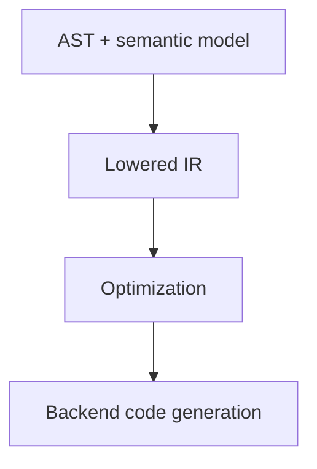
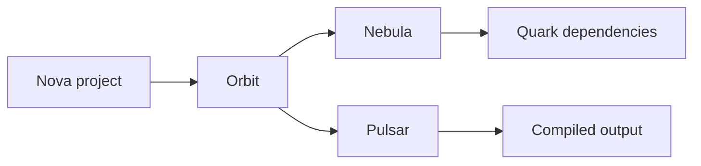

# Nova language design

This document describes the long-term Nova language and ecosystem vision. It is
intentionally separate from implementation status: many ideas here are planned
goals, not features fully implemented by the current Java front end.

For current compiler status, see [`../README.md`](../README.md),
[`../PLAN.md`](../PLAN.md), and [`architecture.md`](architecture.md).

> [!IMPORTANT]
> The README should describe what a reader can build, run, or inspect today.
> Planned language and ecosystem ideas belong here or in the implementation
> plan until they are implemented.

## Design goal

Nova is intended to be a compiled, object-oriented language with a hard-static
type system and syntax that feels familiar to C-like and Java-like programmers.

The long-term goal is to combine:

- native compilation;
- predictable performance;
- object-oriented modeling;
- strong compile-time guarantees;
- rich standard tooling;
- a standard library broad enough for common work without making every project
  depend immediately on fragile third-party packages.

Nova syntax should stay familiar and explicit where that improves compiler
guarantees. The language should not invent a new visual style for its own sake.

## Classes and value types

A central design idea is the distinction between **classes** and mathematical or
value-like **types**.

Classes are object-oriented entities with identity, state, behavior, and
lifecycle. They are intended for user-defined domain objects, services,
components, data structures with behavior, and objects that use inheritance or
polymorphism.

Planned class features include:

- fields;
- methods;
- constructors;
- access modifiers;
- inheritance;
- method overriding and overloading;
- generic class parameters;
- strict compile-time visibility checks.

Class rules that define the intended model:

- every class member must declare `public`, `private`, or `protected`;
- private and protected access are enforced by the compiler, with no reflection
  loophole;
- public fields can be read and written directly;
- private fields are accessed only from inside the class body or through
  explicit public API;
- method overloading is based on parameter number, order, and types.

Operator overloading does not belong to ordinary classes. Classes model object
identity, state, lifecycle, and dispatch.

Value-like types are intended to represent mathematical entities whose behavior
is defined by algebraic properties rather than object identity. Examples may
eventually include vectors, matrices, tensors, numeric domains, and values with
operator overloads.

Long-term rule:

- classes model object identity and behavior;
- types model value semantics and operator-defined algebra;
- operator overloading belongs to types, not ordinary classes.

This distinction is only partially represented today by semantic type symbols.
Full user-defined value types are future type-system work.

## Hard-static typing

Nova is intended to be statically typed in a stricter sense: **hard-static**.

Hard-static means type information is available at compile time. Nova should not
need dynamic declarations, runtime type discovery, or reflection-driven dispatch
to understand ordinary program meaning.

Rules and consequences:

- reflection is not a core language feature;
- runtime type inspection should not be required for ordinary language
  semantics;
- dynamic method invocation is intentionally excluded from the core model;
- overload resolution happens during compilation;
- operator dispatch for user-defined value types happens during compilation;
- type inference, where supported, must resolve to concrete compile-time types;
- generic instantiations are known at compile time;
- declarations that cannot be statically typed should not be accepted as
  ordinary Nova declarations;
- compiler guarantees should enable aggressive optimization and zero-cost
  abstractions.

> [!WARNING]
> Hard-static typing is not just "static typing with fewer dynamic features."
> Constructs that depend on runtime type inspection should be redesigned as
> compile-time constructs.

## Inheritance and polymorphism

Inheritance is planned for classes, not mathematical/value types. When a class
extends another class, it inherits method signatures, method implementations, and
fields according to the class model.

Multiple inheritance is allowed in the long-term design only if it remains
compile-time safe:

- if multiple parents provide the same method signature, the subclass must
  explicitly override it;
- if multiple parents declare a field with the same name, that is a compile-time
  error;
- inherited field conflicts have no automatic merge or shadowing rule.

Abstract and final behavior is also part of the intended design:

- abstract methods may be declared;
- a class with unimplemented abstract methods is abstract and cannot be
  instantiated;
- a class extending an abstract class must implement inherited abstract methods
  or remain abstract;
- final classes cannot be extended;
- final methods cannot be overridden.

Bounded polymorphism should stay compile-time visible. For example, a parameter
may be constrained to a known upper bound such as `T : Comparable`. Inside the
generic body, only the signature guaranteed by that bound is available.

## Compile-time tooling

Because runtime reflection is not intended to be a core language feature,
tooling that other languages often implement with reflection should be
implemented through compile-time mechanisms.

Examples include:

- test discovery;
- serialization metadata;
- dependency injection registries;
- plugin or command registries;
- schema generation;
- generated adapters for standard-library tooling.

The expected direction is compiler-assisted code generation: the compiler or
build tool scans source-level constructs and emits direct registries or metadata
artifacts based on resolved declarations, resolved types, visibility rules, and
eventually package/project boundaries.

## Generics and class parameters

Nova's long-term generic design is intended to avoid type erasure. Generic
instantiations should remain concrete and known at compile time.

For example:

```nova
List[int]
List[string]
```

would represent different concrete instantiations.

Intended rules:

- generic instances with different parameters are different concrete types;
- concrete instantiations are generated with type parameters substituted by
  concrete types;
- bounded generic parameters constrain what operations are available inside
  generic bodies;
- recursively bounded generics, such as `Comparable[T]`, are possible design
  targets;
- monomorphization or another compile-time specialization strategy is expected.

Nova also reserves space for class parameters: compile-time values that are part
of class instantiation.

```nova
class Tensor[T, (N : int)] { }
class SquareMatrix[T, (N : int)] :: Tensor[T, N, N] { }
```

Class parameter values are part of type identity. `Tensor[int, N = 3]` and
`Tensor[int, N = 2]` are different types. The compiler must substitute class
parameters through inheritance chains, so this is a type-system and
monomorphization feature, not parser sugar.

These features are deferred until the compiler has a stable semantic type model.

## Variadic generics and lambdas

Variadic generics are a possible future feature and one of the hardest parts of
the design. Syntax such as:

```nova
Tuple[{A}]
```

requires the type checker and monomorphizer to reason about an unbounded number
of type parameters. This affects type representation, constraint solving,
function signatures, overload resolution, monomorphization, and standard library
design.

Lambdas depend on the same generic machinery. One possible model is to treat
lambdas as compiler-generated classes implementing a function-like abstraction:

```nova
Function[{A}, R]
```

For example:

```nova
(x: int, y: int) -> int { return x + y; }
```

could lower to an anonymous generated class extending
`Function[{int, int}, int]` and implementing a statically typed `call` method.

Because lambdas are function-like class instances, calls may use virtual dispatch
by default. The compiler should devirtualize lambda calls when the concrete
lambda type is statically known, especially in tight loops or higher-order
standard-library operations.

> [!WARNING]
> Variadic type parameters and lambdas are coupled. Lambdas should wait until
> function types, variadic generic parameter lists, and IR lowering are ready.

## Native compilation

The long-term backend goal is native compilation. The current repository does
not implement IR generation, optimization, assembly generation, machine-code
emission, object-file generation, or executable linking.

The planned route is:



Skipping directly from AST to machine code would make the compiler harder to
evolve.

## Ecosystem vocabulary

Nova uses an astronomy and particle-physics inspired naming scheme. These names
are design commitments, not current implementation status.

| Name | Intended role | Status |
| --- | --- | --- |
| **Nova** | The programming language | Design and compiler front end in progress |
| **Pulsar** | The Nova compiler | Current Java front end is the beginning of this tool |
| **Orbit** | Package manager and dependency tool | Planned |
| **Nebula** | Community package registry used by Orbit | Planned |
| **Quark** | Standalone Nova artifact/package | Planned vocabulary |
| **Core** | Standard base package | Planned |

A typical future dependency flow should read naturally as:



Orbit resolves, downloads, and upgrades Quark dependencies from Nebula, then
invokes Pulsar with the resolved project and dependency graph.

### Quarks

A **Quark** is any standalone Nova artifact that can be versioned, published,
downloaded, and depended on. It may represent a library package, application
package, standard-library component, future compiler/tooling extension, or a
package containing generated Nova code or metadata.

The exact package format is not designed yet. The name is reserved so
documentation, CLI language, and future metadata files can stay consistent.

### Orbit

**Orbit** is the planned package manager. Intended responsibilities include
project initialization, metadata reading, dependency resolution, downloads from
Nebula or another registry, dependency updates, local caching, lockfiles, and
invoking Pulsar with the correct graph.

Possible future commands:

```bash
orbit init
orbit add solar
orbit add atlas@1.2.0
orbit update
orbit build
orbit test
```

These commands are examples, not committed CLI syntax.

### Nebula

**Nebula** is the planned community registry. It should host published Quarks,
expose version metadata, serve dependency metadata to Orbit, support discovery,
and eventually support ownership, signatures, or other supply-chain features.
Long term, Orbit may support private or alternate registries too.

### Pulsar

**Pulsar** is the name reserved for the Nova compiler. As the compiler grows, it
is expected to include lexing, parsing, diagnostics, semantic analysis, type
checking, project-level compilation, standard-library loading, IR generation,
optimization, and backend code generation.

Potential future command shape:

```bash
pulsar check main.nv
pulsar build
pulsar run
```

Actual CLI design is not finalized.

## Standard package family

Nova's standard library should be split into a small base package plus optional
on-demand packages.

| Name | Intended area |
| --- | --- |
| **Core** | Base language/runtime package and fundamental declarations |
| **Solar** | Math and numeric utilities |
| **Pulse** | Event-driven programming, I/O, and asynchronous interaction |
| **Spectrum** | Graphics, rendering, and GPU-oriented utilities |
| **Echo** | Audio utilities |
| **Atlas** | Data structures and collections |

The intended dependency model:

- Core is the minimal base package;
- additional standard packages are loaded on demand;
- standard packages are conceptually Quarks;
- user code and standard-library code should eventually pass through the same
  package, declaration, and compilation pipeline.

Core should stay small. If a feature can live in a focused optional package, it
probably should. Some collection fundamentals may live in Core at first, but
Atlas should be the long-term home for richer data structures.

## Future names

The following areas still need names and design decisions:

| Area | Possible role |
| --- | --- |
| Build/workspace metadata | Project manifests, lockfiles, workspaces |
| Test framework | Compile-time test discovery and generated test registry |
| Documentation generator | Nova API documentation generation |
| Formatter | Source formatting tool |
| Linter/static analyzer | Style and correctness checks beyond compilation |
| Language server | Editor integration and IDE features |
| Native runtime support | Low-level runtime helpers, if needed |

When adding new names, prefer names that fit the theme, are easy to pronounce,
are short enough for CLI usage, do not collide with established names, and
describe one clear responsibility.
