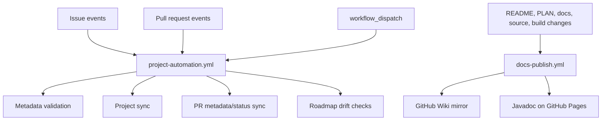

# Project automation

Nova uses GitHub Issues, pull requests, GitHub Projects, the repository Wiki,
and GitHub Pages as one automation surface. This page consolidates the workflow
and publishing notes that used to live across several small docs pages.

## Workflow overview

Project automation has one primary workflow entry point:

```text
.github/workflows/project-automation.yml
```

Documentation publishing has one workflow entry point:

```text
.github/workflows/docs-publish.yml
```

The Python automation code lives in the `nova_automation` package under
`.github/scripts/` and is invoked through `python3 -m` package entry points.



## Required secrets

Jobs that write to the user-level GitHub Project need:

```text
PROJECT_TOKEN
```

The token must have GitHub Projects write access. The built-in `GITHUB_TOKEN` is
still used for normal repository access, but it is usually not enough for
writing user-level Projects v2 fields.

Wiki publishing first tries `GITHUB_TOKEN`. If GitHub refuses writes to the Wiki
repository, create:

```text
WIKI_DEPLOY_TOKEN
```

Use a fine-grained token or GitHub App token with enough permission to push to
the Wiki repository.

## Issue forms and metadata

New issues should use the YAML issue forms in `.github/ISSUE_TEMPLATE/`. Blank
issues are disabled so contributors are guided through the same structured
fields.

Available forms:

- bug report;
- compiler task;
- design task;
- feature proposal;
- refactoring task.

Issue forms do not duplicate native GitHub issue metadata in the body:

- GitHub issue labels are the source of truth for issue kind;
- GitHub issue milestones are the source of truth for roadmap grouping.

The forms only collect metadata that GitHub does not natively model for this
repository workflow:

```markdown
### Priority

1 - Important next step

### Size

M

### Suggested status

Ready

### Expected start

2026-07-01

### Expected deadline

2026-07-31
```

`Priority`, `Size`, and `Suggested status` are synced into Project fields.
`Expected start` and `Expected deadline` are optional `YYYY-MM-DD` fields that
write to the Roadmap date fields. Empty schedule values are ignored and do not
clear existing Project dates.

The canonical source for managed labels, milestones, priorities, statuses, and
sizes is `nova_automation.project.metadata`. Update form options locally with:

```bash
PYTHONPATH=.github/scripts python3 -m nova_automation.issues.forms
```

Check committed forms without editing files:

```bash
PYTHONPATH=.github/scripts python3 -m nova_automation.issues.forms --check
```

Validate native issue metadata helper behavior locally:

```bash
PYTHONPATH=.github/scripts python3 -m nova_automation.issues.native_metadata --issue-number 0 --labels refactor --milestone "Nova MVP compiler"
```

## Managed milestones and labels

Managed issue-kind labels:

- `bug`
- `feature`
- `refactor`
- `design`
- `research`
- `test`
- `docs`

Managed milestone names:

- `Project workflow`
- `Nova MVP compiler`
- `Advanced overload and override rules`
- `Access control`
- `Inheritance conflict checks`
- `Generics`
- `Bounded generics`
- `Class parameters`
- `Operator-overloadable Nova types`
- `Lambdas`
- `Variadic generics`
- `Monomorphization`
- `Future development`

Use `Nova MVP compiler` for Phase 1 through Phase 8 work. Use the specific
advanced-feature milestones for post-MVP Phase 9 work.

## Project workflow jobs

### Automation health

The `automation-health` job runs on pull requests and manual dispatches. It is a
no-network guard for safe refactors of the YAML/Python automation layer.

Local command:

```bash
PYTHONPATH=.github/scripts python3 -m nova_automation.cli.automation_health
```

It checks that:

- expected automation workflows and Python package files still exist;
- every Python file under `.github/scripts/` compiles without being imported;
- workflows do not reference removed `.github/scripts/*.py` compatibility
  wrappers;
- workflows only call subcommands declared by
  `nova_automation.cli.project_automation`;
- workflow-managed Project commands remain wired from at least one workflow;
- the consolidated Project automation workflow and health-check entry point are
  documented.

It also runs issue-form checks, native metadata checks, and lightweight Python
unit tests for automation helpers:

```bash
PYTHONPATH=.github/scripts python3 -m unittest discover -s .github/tests -p "*_test.py"
```

This does not replace the Java test suite.

### Native issue metadata check

The `check-issue-metadata` job runs for issue events other than `closed`.

Rules:

- every issue should have at least one managed label;
- every issue should have one managed roadmap milestone;
- unmanaged milestones fail the workflow so they are fixed before roadmap
  automation relies on them.

### Issue sync

The `sync-issue` job runs when an issue is opened, edited, reopened, or
transferred.

Representative commands:

```bash
PYTHONPATH=.github/scripts python3 -m nova_automation.cli.project_automation sync-issue --repo LucaPrevi0o/NovaLanguage --issue-number 28
PYTHONPATH=.github/scripts python3 -m nova_automation.cli.project_automation sync-labels --repo LucaPrevi0o/NovaLanguage --issue-number 28
PYTHONPATH=.github/scripts python3 -m nova_automation.project.schedule --repo LucaPrevi0o/NovaLanguage --issue-number 28
```

Responsibilities:

- add the issue to the roadmap Project when missing;
- sync `Priority`, `Size`, and `Suggested status` into Project fields;
- preserve native GitHub labels as the source of truth for issue kind;
- sync optional `Expected start` and `Expected deadline` into Roadmap date
  fields;
- ensure reopened issues are visible in the Project.

Schedule synchronization writes to Project fields named `Start date` and
`End date` by default. The workflow can override those names with
`PROJECT_START_DATE_FIELD` and `PROJECT_END_DATE_FIELD`. The fields must already
exist in the configured roadmap Project.

### Issue archive sync

The `sync-issue-archive` job runs when an issue is closed or reopened.

```bash
PYTHONPATH=.github/scripts python3 -m nova_automation.cli.project_automation sync-issue-archive --repo LucaPrevi0o/NovaLanguage --issue-number 39
```

Rules:

- closed issues are archived only when their roadmap Project status is already
  `Done`;
- closed issues with another status produce a warning and remain visible;
- reopened/open issues are unarchived when they already exist in the Project;
- open issues missing from the Project are added back as visible items;
- the job does not change issue status, reopen issues, close issues, or edit
  issue metadata.

### Pull request metadata and status sync

The `align-pr-metadata` job runs for non-closed pull request events.

```bash
PYTHONPATH=.github/scripts python3 -m nova_automation.pull_requests.metadata_alignment --repo LucaPrevi0o/NovaLanguage --pr-number 12
```

It copies managed labels, a shared milestone, and selected Project fields from
referenced issues to the pull request when the referenced issues agree.
Conflicts are reported as warnings. The workflow does not edit source issues.

The `sync-pr-status` job runs after metadata alignment has had a chance to run.

```bash
PYTHONPATH=.github/scripts python3 -m nova_automation.cli.project_automation sync-pr-status --repo LucaPrevi0o/NovaLanguage --pr-number 12
```

Rules:

- draft pull requests do not change issue status;
- non-draft pull requests move referenced issues to `In Review`;
- merged pull requests move only closing-keyword issue references to `Done`;
- the job updates Project status only and does not close issues directly;
- after a merged closing-keyword PR moves an issue to `Done`, the script
  attempts issue archive sync.

### Roadmap drift check

The `check-roadmap-drift` job runs on pull requests.

```bash
PYTHONPATH=.github/scripts python3 -m nova_automation.cli.project_automation check-plan-drift --repo LucaPrevi0o/NovaLanguage --plan PLAN.md --readme README.md
```

Checks:

- `PLAN.md` and `README.md` agree on the current focus phase;
- the current focus deliverable milestone has at least one active Project item;
- the current focus deliverable milestone normally has an `In Progress` Project
  item;
- shared deliverable milestones such as `Nova MVP compiler` are not used to
  infer whether one internal phase has stale work from another phase;
- immediate next steps are loosely matched to open issues and reported as
  notices.

Errors fail the workflow. Warnings are reported as GitHub annotations and can
optionally be treated as failures through manual dispatch.

## Manual dispatch targets

The consolidated Project workflow exposes one `target` input:

- `health` runs local no-network automation checks;
- `issue` runs issue sync, label preservation, schedule sync, and archive
  visibility sync for one issue;
- `pr` runs PR metadata alignment and PR status sync for one pull request;
- `all-open` repairs Project fields, labels, schedules, and archive visibility
  for every open issue;
- `all-closed` repairs archive state for every closed issue;
- `drift` runs the roadmap drift check;
- `legacy-audit` reports open issues that still depend on legacy body metadata.

Bulk repair commands remain available locally:

```bash
PYTHONPATH=.github/scripts python3 -m nova_automation.cli.project_automation sync-issue --repo LucaPrevi0o/NovaLanguage --all-open
PYTHONPATH=.github/scripts python3 -m nova_automation.cli.project_automation sync-labels --repo LucaPrevi0o/NovaLanguage --all-open
PYTHONPATH=.github/scripts python3 -m nova_automation.project.schedule --repo LucaPrevi0o/NovaLanguage --all-open
PYTHONPATH=.github/scripts python3 -m nova_automation.cli.project_automation sync-issue-archive --repo LucaPrevi0o/NovaLanguage --all-closed
PYTHONPATH=.github/scripts python3 -m nova_automation.cli.project_automation sync-issue-archive --repo LucaPrevi0o/NovaLanguage --all-open
```

## Legacy metadata cleanup

Legacy body metadata is no longer a supported source for synchronization. Audit
issues before changing metadata automation or enabling failure-on-findings gates:

```bash
PYTHONPATH=.github/scripts python3 -m nova_automation.cli.project_automation audit-legacy-metadata --repo LucaPrevi0o/NovaLanguage --all-open
```

That command is read-only. It reports issues that still contain legacy
`## Project metadata` blocks, duplicated native metadata headings such as
`### Milestone` or `### Labels`, legacy schedule values, or missing native
labels/milestones that make body metadata the only remaining source.

Legacy cleanup helpers remain available as idempotent maintenance commands:

```bash
PYTHONPATH=.github/scripts python3 -m nova_automation.cli.project_automation remove-legacy-phase-field --confirm
PYTHONPATH=.github/scripts python3 -m nova_automation.cli.project_automation remove-legacy-kind-field --confirm
```

## Documentation publishing

The `Publish documentation` workflow publishes two targets:

1. repository Markdown documentation mirrored to the GitHub Wiki;
2. generated Javadoc HTML deployed to GitHub Pages.

### Wiki mirroring

The workflow mirrors:

- `README.md` to `Home.md`;
- `PLAN.md` to `Compiler-Upgrade-Plan.md`;
- each `docs/*.md` file to one Wiki page;
- generated `_Sidebar.md`;
- generated `API-Reference.md`.

The Wiki repository is cloned only inside the GitHub Actions runner as
`wiki-repo/`. Do not commit a Wiki clone into the main repository. If you clone
the Wiki locally for debugging, use a temporary ignored folder:

```bash
git clone https://github.com/OWNER/REPOSITORY.wiki.git wiki-repo
```

`wiki-repo/`, `.wiki/`, and `wiki/` are ignored by `.gitignore`.

The Wiki must exist before the workflow can push to it. Initialize it by opening
the repository on GitHub, going to the Wiki tab, creating the first page
manually, and re-running the workflow.

GitHub renders Mermaid diagrams and MathJax-backed mathematical expressions in
wikis and Markdown files. Prefer Mermaid for explanatory compiler or automation
flows, and keep math notation limited to places where it clarifies a type-system
or compiler rule. See GitHub's docs on
[creating diagrams](https://docs.github.com/en/get-started/writing-on-github/working-with-advanced-formatting/creating-diagrams)
and
[writing mathematical expressions](https://docs.github.com/en/get-started/writing-on-github/working-with-advanced-formatting/writing-mathematical-expressions).

### Javadoc publishing

The workflow generates Javadocs with:

```bash
./mvnw -B -ntp test javadoc:javadoc
```

Maven writes Javadoc output to:

```text
target/site/apidocs/
```

The workflow copies that output to `_site/javadoc/`, uploads `_site/` as a
GitHub Pages artifact, and deploys it with GitHub Pages Actions. The workflow
fails before deployment if the expected files are missing.

Generate Javadocs locally with:

```bash
./mvnw javadoc:javadoc
```

Then open:

```text
target/site/apidocs/index.html
```

The `target/` directory is ignored and generated Javadoc should not be committed.

GitHub Pages must be configured in repository settings to deploy from GitHub
Actions. For a normal project Pages repository, the generated Javadoc is
available under:

```text
https://OWNER.github.io/REPOSITORY/javadoc/
```

The publishing workflow runs on pushes to `main` that affect source code, docs,
the build file, or the workflow itself, and on manual `workflow_dispatch` runs.
Pull requests do not publish the Wiki or Pages site.
